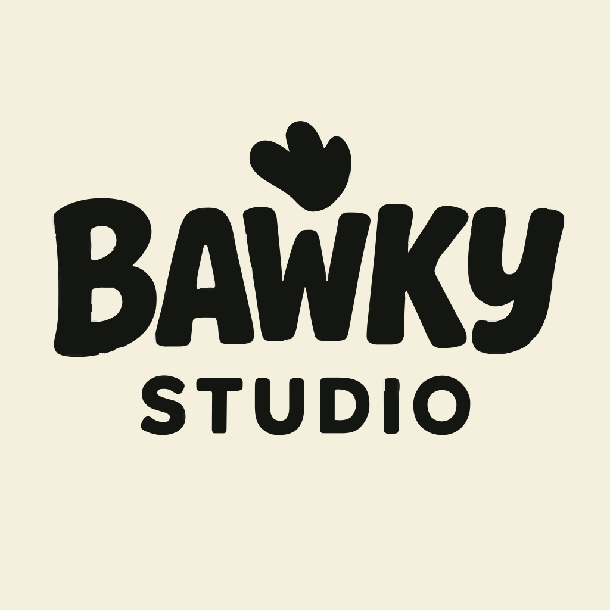

# Bawky Studio 웹사이트

Bawky Studio는 아늑한 서사형 경험을 만드는 소규모 인디 팀입니다.  
링크 : https://www.bawkystudio.com/en/main

## 하이라이트
- `next-intl` 기반 한·영 이중 언어 경험
- 정적 타입 데이터 정의에서 바로 불러오는 게임/이벤트 페이지로 빠른 반복
- IP를 강조하는 영상 히어로 섹션과 플레이 영상 임베드
- 팀 소개, 이벤트/데브로그, 연락 섹션을 하나의 코드베이스로 운영

## 기술 스택
- React 19 + Next.js 15(App Router)
- Tailwind CSS v4 디자인 토큰 + `globals.css` 사용자 정의 스타일
- `src/app/[locale]` 라우팅에서 동작하는 `next-intl`
- Vercel 중심 SSR/엣지 친화 배포 구성
- TypeScript 우선 컴포넌트, ESLint 9, PostCSS/Tailwind 파이프라인

## 프로젝트 구조
```
├─ components/         // Shared UI: Navbar, Footer, CTA button
├─ messages/           // Copy blocks consumed by next-intl
├─ public/             // Artwork, gameplay captures, videos
├─ src/app/            // App Router pages & layouts (per-locale)
│  ├─ [locale]/main    // Landing experience
│  ├─ [locale]/games   // Portfolio grid + individual game slugs
│  ├─ [locale]/events  // Interactive event pages + form routes
│  └─ [locale]/team    // Studio roster spotlight
├─ src/locales/        // Locale dictionaries
├─ src/i18n/           // Routing + request helpers
└─ scripts/            // Deploy hooks (e.g., CodeDeploy post-step)
```

## i18n 키 검증
영문/국문 메시지 키 누락을 확인하려면 아래 스크립트를 실행하세요.

```bash
node scripts/check-i18n.js
```

## 라이선스
© Bawky Studio. All rights reserved. 
